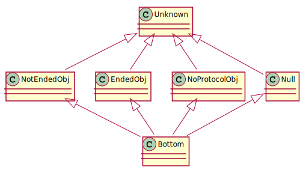
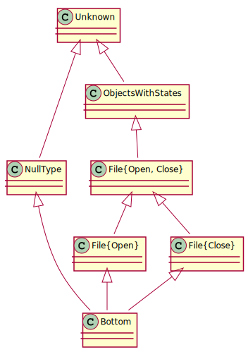

# Java Typestate Checker plugin for Checker Framework

*Work in progress...*

## How it works

Adding a `@mungo.lib.Typestate("ProtocolFile")` annotation to the top of a class enforces that instances of that class follow the protocol defined by the protocol file. Every time a method call on a object is encountered, we make sure that object is in a state that allows that invocation. The type of the object then changes to conform to the new state reached after that method call. We also make sure protocols are completed.

### Type system

<!-- http://www.plantuml.com/plantuml/uml/NSqn2i9048NXVayHKgcG6rW4mT8O40yGirEixix0-YOs7bx8Wc6sUl0Lx-_Vc38qHNVd5yk7c-EtwvhhuqapN9b2xGqJQ7VOjuRFxCaR6MJC0fcb-XmqLZBca0B2GfOlif1tMw_eIG19RkqPsNgMDLhuruokCICziTSKVm00 -->

- `Unknown` is the top type. It includes all possible values.
- `Object` contains all objects except `null`.
- `State` represents objects which are in a specific state.
- `Ended` is the set of all objects with completed protocols.
- `NoProtocol` is the set of all objects without protocol.
- `Null` is the set with only the `null` value.
- `Primitive` is the set of all primitive values. Like integers and booleans.
- `Moved` is a type applied to variables that point to an object that was moved. Like in Rust, where if something takes ownership of some data, that data is considered to have been moved. Variables with the `Moved` type cannot be used, because they no longer own the data.
- `Bottom` is the bottom type. Used for computations that do not finish or error. Empty set. Like `Nothing` in many languages or like `never` in TypeScript.

Subtypes of `State(*)` are for example, the type of files that are in the `Open` or `Read` states, or the type of files that are only in the `Open` state.

The type of files that are only in the `Open` state is also a subtype of the type of files that are in the `Open` or `Read` states, since the set `{Open}` is contained in `{Open, Read}`.

The type of files that are in the `Open` state and the type of files that are in the `Read` state are not subtypes of each other, since one is not contained in the other and vice-versa.

<!-- http://www.plantuml.com/plantuml/uml/SoWkIImgAStDuGhDoyxBByzJiAdHrLNmAyr14r4ABaaiITNGqbJYGZ2XKcwPEQdL_WMfUJeAGQc9ARLAN1X264e9AeAQ1789HDWflwGaFvSBsGWK2OGsD0c7rBmKe0y1 -->

### Checking

- The type checker tracks all the possible states that an object might be in.
- When initializing, an object is only in its initial state.
- If a variable declaration is encountered, for example in a method argument, it is assumed that the object might be in any of its states. That can be refined with the use of `@MungoState({"Open"})`.
- When a method invocation is encountered, considering all possible states, the type checker creates a set with all the possible destination states via that method invocation. If that method invocation happened on the condition of a `if/while` statement or in the expression of a `switch` statement, the possible states are properly refined: if the transition leads to a decision state, only the destination state associated with the relevant label is added to the set of possible states.

<!--
### Architecture

Plugins for the Checker Framework usually extend the `BaseTypeChecker` and then override some aspects of it if necessary. To understand how plugins work it is important to understand how information is stored:

- [AnnotatedTypeMirror](https://checkerframework.org/api/org/checkerframework/framework/type/AnnotatedTypeMirror.html)'s represent types and store type annotations associated with the type. Those annotations constitute the type information specific to the type system implemented by a plugin.
- [Tree](https://docs.oracle.com/en/java/javase/11/docs/api/jdk.compiler/com/sun/source/tree/Tree.html?is-external=true)'s are nodes in an abstract syntax tree.
- [Element](https://docs.oracle.com/en/java/javase/11/docs/api/java.compiler/javax/lang/model/element/Element.html?is-external=true)'s represent a potentially-public declaration that can be accessed from elsewhere: classes, interfaces, methods, constructors, and fields.

Our plugin is composed by:

- `MungoChecker`: The plugin's entry point.
- `MungoVisitor`: Performs assignment checking, method invocation checking and other checks.
- `MungoAnnotatedTypeFactory`: Applies annotations via `MungoDefaultQualifierForUseTypeAnnotator` and `MungoTreeAnnotator`, which are refined by the flow-sensitive analysis provided by `MungoAnalysis` and `MungoTransfer`
- `MungoQualifierHierarchy`: Defines the subtyping relationship between annotations
- `MungoDefaultQualifierForUseTypeAnnotator`: Applies a set of annotations to [Elements](https://docs.oracle.com/en/java/javase/11/docs/api/java.compiler/javax/lang/model/element/Element.html?is-external=true)
- `MungoTreeAnnotator`: Applies a set of annotations to [Trees](https://docs.oracle.com/en/java/javase/11/docs/api/jdk.compiler/com/sun/source/tree/Tree.html?is-external=true)
- `MungoAnalysis`: Tracks annotations using flow-sensitive analysis
- `MungoTransfer`: Applies type information refinement

Since annotations are only able to store some types of values, not arbitrary objects, we store a `long` id value in each annotation that is then mapped to an object which stores the concrete type information.

More details: [Manual - How to create a Checker plugin](https://checkerframework.org/manual/#creating-a-checker)
-->

## Run version 1

Run the following command from the `dist` folder:

`java -jar checker-3.3.0/checker.jar -classpath mungo-checker-v1.jar -processor org.checkerframework.checker.mungo.MungoChecker *.java`

## Build and test

- Unix: `./gradlew build`
- Windows: `gradlew.bat build`

## Build jar file

- Unix: `./gradlew buildJar`
- Windows: `gradlew.bat buildJar`

The produced jar file goes into the `examples` folder.

## Remote testing

- Unix: `./gradlew test --debug-jvm`
- Windows: `gradlew.bat test --debug-jvm`

## Running comparison tests

1. Extract [Checker Framework](https://checkerframework.org/) into the `examples` folder.
1. Build jar file.
1. Run `cd examples && bash run` on Unix or Cygwin.
1. Check `examples/comparison` and nested folders for results.

## Comparison

[Comparison table between this version of Mungo and other versions](https://github.com/jdmota/abcd-mungo/wiki/Comparison)

## Roadmap and TODO's

[Roadmap and TODO's](https://github.com/jdmota/abcd-mungo/wiki/Roadmap-and-TODOs)
